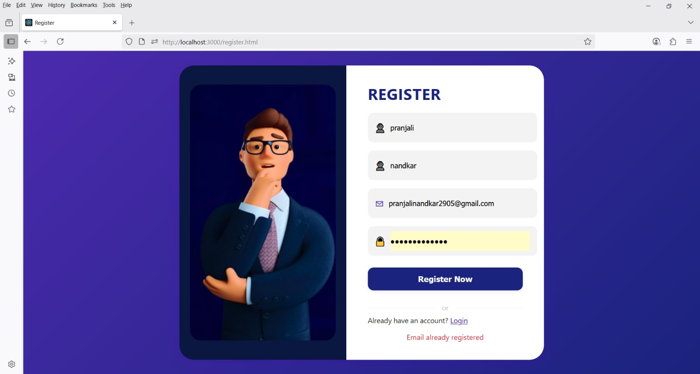

# Login/Register App

A modern login and registration system with Google OAuth, built using TypeScript, Node.js, Express, and MongoDB.

## Features
- Login and registration with email and password
- Google login (OAuth 2.0)
- Password validation (8-12 chars, uppercase, lowercase, number, symbol)
- Modern, responsive UI (HTML, CSS, TypeScript)
- MongoDB for user storage

## Technologies Used
- **Frontend:** HTML, CSS, TypeScript
- **Backend:** Node.js, Express, TypeScript
- **Database:** MongoDB
- **Authentication:** Passport.js, Google OAuth 2.0

## Screenshots

### Login Page Example 1


### Login Page Example 2


### Register Page


### Forgot Password Page


### Password Reset Link Sent


### Reset Password Page


### Welcome Page


## Prerequisites
- Node.js (v16+ recommended)
- npm
- MongoDB (local or Atlas)

## Setup Instructions

1. **Clone the repository**
   ```bash
   git clone <repo-url>
   cd login
   ```

2. **Install dependencies**
   ```bash
   npm install
   ```

3. **Set up environment variables**
   - Copy `env.example` to `.env` and fill in your MongoDB URI and Google OAuth credentials.

4. **Compile TypeScript**
   ```bash
   npx tsc
   ```
   Or compile individual files as needed:
   ```bash
   npx tsc login/main.ts --outDir login --target ES6 --module commonjs
   npx tsc login/register.ts --outDir login --target ES6 --module commonjs
   ```

5. **Start the server**
   ```bash
   npx ts-node login/server.ts
   ```
   The server will run at [http://localhost:3000](http://localhost:3000)

6. **Open the frontend**
   - Login page: [http://localhost:3000/index.html](http://localhost:3000/index.html)
   - Register page: [http://localhost:3000/register.html](http://localhost:3000/register.html)

## Notes
- Make sure MongoDB is running and accessible.
- For Google login, set up OAuth credentials at https://console.developers.google.com/ and use the correct redirect URI.
- All frontend logic is written in TypeScript and compiled to JavaScript for browser compatibility.

## License
MIT 